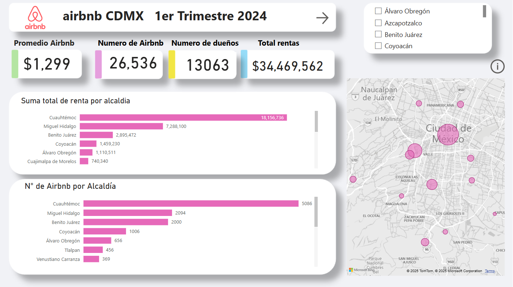
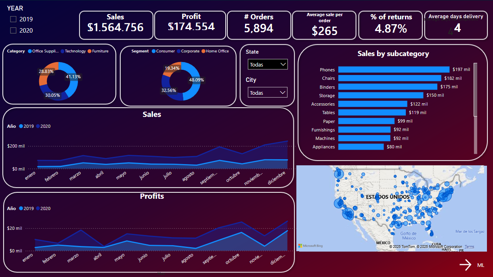
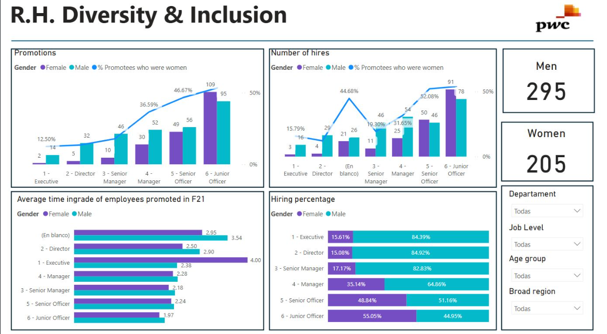
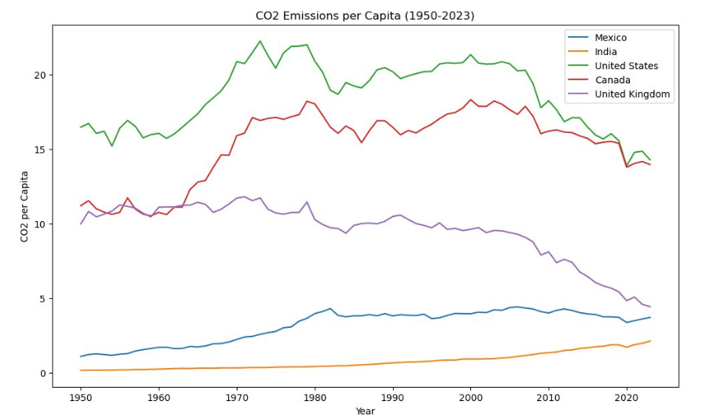
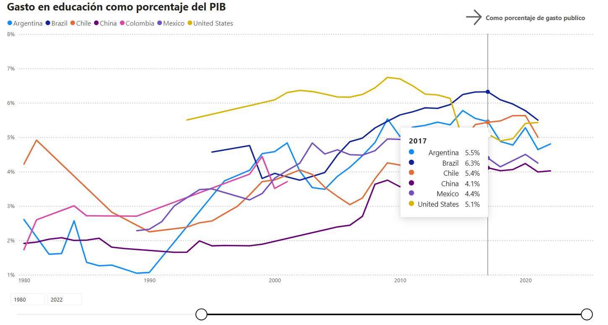

# 👋 Hola, soy Diego
¡Bienvenido a mi portafolio de proyectos!

## 🚀 Sobre mí
Soy un apasionado por el análisis de datos y la creación de soluciones de Business Intelligence. Me especializo en transformar datos en insights valiosos a través de herramientas como Power BI, SQL y Python.

Actualmente estoy enfocado en crecer profesionalmente en el área de BI, aplicando mis conocimientos en visualización, modelado de datos y generación de reportes interactivos.

Tambien me encuentro estudiando la ingeniera de Ciencia de Datos, por lo cual he agregado proyectos de ML.

### 🛠️ Tecnologías principales
Power BI: Diseño de dashboards, modelado de datos, DAX, Power Query.

SQL: Consultas para extracción y transformación de datos.

Python: Análisis de datos con Pandas, visualizaciones con Matplotlib.

Excel Avanzado: Tablas dinámicas, dashboards, modelado.

📂 Proyectos destacados

### 📊 Airbnb México

- Herramientas: Power BI, SQL
- Descripción: Visualización de la disponibilidad y precios de Airbnb en CDMX.
  
### 📊 Tienda Online

- Herramientas: Power BI, Python
- Descripción: Visualización de métricas de ventas, clientes y productos para un eccomerce simulado.

### 📊 R.H. Diversity & Inclusion 

- Herramientas: Power BI, CSV
- Descripcion: Visualizacion de paridad de genero en puestos de trabajo dentro de una empresa.
  
### 📊 Análisis de CO₂

- Herramienta: Python
- Descripción: Evaluación de niveles de emisiones de carbono en distintos países.	

### 📊 Educación Global	

- Herramientas: Python
- Descripción: Análisis de indicadores de acceso y calidad educativa en varios países.

# 📫 Cómo contactarme
LinkedIn: www.linkedin.com/in/diego-axel-lopez-gomez-19ba78325

Correo: diegoaxel.lopez96@gmail.com

GitHub: Floki-Dreamer

# 🚀 ¡Gracias por visitar mi portafolio!

